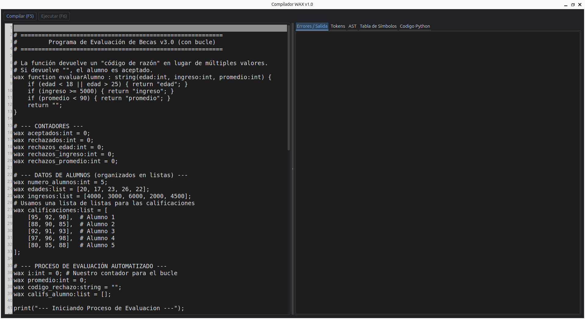

# Compilador WAX 🚀

¡Bienvenido al Compilador WAX! Este es un completo Entorno de Desarrollo Integrado (IDE) y compilador para el lenguaje de programación interpretado "Wax". Este proyecto toma código fuente escrito en Wax, realiza un análisis léxico, sintáctico y semántico, y finalmente lo traduce a código Python limpio y ejecutable.

El proyecto incluye tanto la lógica del compilador de 4 fases como una interfaz gráfica de usuario (GUI) completa construida con PySide6.

 


---

## ⚡ Características Principales

* **IDE Gráfico Completo:** Una GUI construida con PySide6 que sirve como un editor de texto y entorno de ejecución.
* **Editor de Código Avanzado:** El editor incluye numeración de línea y resaltado de la línea actual.
* **Compilador de 4 Fases:**
    1.  **Léxico (`lexer.py`):** Convierte el código en tokens.
    2.  **Sintáctico (`parser.py`):** Construye un Árbol de Sintaxis Abstracta (AST) y reporta errores de sintaxis con precisión.
    3.  **Semántico (`semantic.py`):** Valida el AST, chequea tipos, maneja ámbitos y detecta errores lógicos.
    4.  **Generador (`generator.py`):** Traduce el AST validado a código Python 3.
* **Ejecución Directa:** Ejecuta el código generado con un solo clic y captura la salida (incluyendo `print`) en la GUI.
* **Input Interactivo:** Soporta entrada del usuario mediante diálogos emergentes en la GUI y entrada estándar en CLI.
* **Depuración Visual:** Muestra los **Tokens**, el **AST**, la **Tabla de Símbolos** y el **Código Python Generado** en pestañas separadas para facilitar el análisis y debugging.
* **Manejo de Ámbitos (Scopes):** Diferencia correctamente entre ámbitos globales, de función y de bloque (`if`, `while`, `for`).
* **Detección de Errores Avanzada:** Reporta errores como:
    * Errores de sintaxis (ej. `falta un '}' en la línea 63`).
    * Errores semánticos (ej. `tipos incompatibles`, `variable no declarada`).
    * División por cero.
    * Código inalcanzable (después de un `return`).
    * Validación de tipos en operadores compuestos e incremento/decremento.
    * Validación de tipos en bucles `for`.
* **Tipado de Listas:** Soporta declaraciones de listas con chequeo de tipos y métodos `append()` y `remove()`.
* **Operadores Avanzados:**
    * Asignaciones compuestas: `+=`, `-=`, `*=`, `/=`
    * Incremento/Decremento: `++`, `--` (pre y post)
    * Operador NOT: `!`
    * Operador unario negativo: `-x`

---

## 🛠️ Stack de Tecnologías

* **Python 3.10+** (Recomendado)
* **PLY:** Para el análisis léxico y sintáctico.
* **PySide6:** Para toda la interfaz gráfica de usuario.
* **pyqtdarktheme:** (Opcional) Para el tema oscuro del IDE.

---

## 🚀 Cómo Usarlo

Este proyecto se puede ejecutar como un IDE gráfico (recomendado) o como una herramienta de línea de comandos (CLI).

### 1. Instalación

1.  Clona o descarga este repositorio.
2.  Navega a la carpeta del proyecto y crea un entorno virtual:
    ```bash
    # Se recomienda Python 3.10 o 3.11 para máxima compatibilidad de librerías
    python3.11 -m venv venv
    ```
3.  Activa el entorno virtual:
    * En Linux/macOS: `source venv/bin/activate`
    * En Windows: `.\venv\Scripts\activate`
4.  Instala las dependencias:
    ```bash
    pip install ply PySide6 pyqtdarktheme
    ```

### 2. Ejecutar el IDE Gráfico (Recomendado)

Una vez instaladas las dependencias, simplemente ejecuta `gui.py`:

```bash
python gui.py
```
El IDE se abrirá con un código de ejemplo. ¡Ya puedes compilar (F5) y ejecutar (F6)!

### 3. Ejecutar la Versión de Consola (CLI)

También puedes usar `main.py` para compilar archivos desde la terminal.

```bash
# Muestra todas las fases (Tokens, AST, Tabla, Código)
python main.py program.wax --all

# Solo compila y ejecuta el archivo
python main.py program.wax --execute
```
**Opciones de la CLI:**
* `program.wax`: (Requerido) El archivo a compilar.
* `--tokens`: Muestra la salida del léxico.
* `--ast`: Muestra el árbol de sintaxis abstracta.
* `--table`: Muestra la tabla de símbolos.
* `--code`: Muestra el código Python generado.
* `--execute`: Ejecuta el código generado.
* `--all`: Activa `--tokens`, `--ast`, `--table` y `--code`.

---

## 📜 Referencia del Lenguaje Wax

### Tokens

| Tipo | Descripción | Ejemplos |
| --- | --- | --- |
| **Palabras Clave** | Reservadas por el lenguaje | `wax`, `function`, `if`, `else`, `while`, `for`, `to`, `step`, `return`, `print`, `append`, `remove` |
| **Funciones Nativas** | Funciones incorporadas | `str`, `input` |
| **Identificadores** | Nombres de variables/funciones | `mi_var`, `evaluarAlumno` |
| **Tipos** | Tipos de datos primitivos | `int`, `double`, `string`, `bool`, `list`, `void` |
| **Literales** | Valores fijos | `123`, `5.5`, `-10`, `"hola"`, `true`, `false` |
| **Operadores Aritméticos** | Operaciones matemáticas | `+`, `-`, `*`, `/` |
| **Operadores de Asignación** | Asignación y compuesta | `=`, `+=`, `-=`, `*=`, `/=` |
| **Operadores de Incremento** | Incremento/Decremento | `++`, `--` |
| **Operadores Relacionales** | Comparaciones | `==`, `!=`, `<`, `>`, `<=`, `>=` |
| **Operadores Lógicos** | Lógica booleana | `&&`, `\|\|`, `!` |
| **Delimitadores** | Símbolos de agrupación y separación | `(`, `)`, `{`, `}`, `[`, `]`, `,`, `;`, `:`, `.` |
| **Comentarios** | Ignorados por el compilador | `# línea` , `/* bloque */` |

### Sintaxis

```wax
# --- Comentarios ---
# Esto es un comentario de una línea.

/*
  Esto es un
  comentario de bloque.
*/

# --- Declaración de Variables ---
# wax <nombre> : <tipo> = <expresión>;
wax mi_entero:int = 10;
wax mi_double:double = -5.75;
wax mi_string:string = "Hola";
wax mi_bool:bool = true;
wax mi_lista:list = [1, 2, 3];
wax lista_vacia:list = []; # El tipo se infiere al agregar elementos

# --- Asignaciones ---
mi_entero = mi_entero + 5;

# Asignaciones compuestas
mi_entero += 10;  # mi_entero = mi_entero + 10
mi_entero -= 5;   # mi_entero = mi_entero - 5
mi_entero *= 2;   # mi_entero = mi_entero * 2
mi_entero /= 4;   # mi_entero = mi_entero / 4

# Incremento y decremento
mi_entero++;      # mi_entero = mi_entero + 1
mi_entero--;      # mi_entero = mi_entero - 1
++mi_entero;      # Pre-incremento
--mi_entero;      # Pre-decremento

# --- Operadores Lógicos ---
wax condicion:bool = (mi_entero > 5) && (mi_string == "Hola");
wax negacion:bool = !condicion;

# --- Estructura IF / ELSE ---
if (mi_entero > 10 && !negacion) {
    print("Condición 1");
} else {
    print("Condición 2");
}

# --- Bucle WHILE ---
wax i:int = 0;
while (i < 5) {
    print(str(i));
    i++;
}

# --- Bucle FOR (loop por variable) ---
# Sintaxis: for (wax variable:int = inicio; condicion; incremento) { ... }

# For básico
for (wax j:int = 0; j < 10; j++) {
    print("j = " + str(j));
}

# For con paso personalizado
for (wax k:int = 0; k <= 20; k += 2) {
    print("k = " + str(k));
}

# For descendente
for (wax m:int = 10; m >= 0; m--) {
    print("m = " + str(m));
}

# For para recorrer listas
wax numeros:list = [10, 20, 30, 40];
for (wax idx:int = 0; idx < 4; idx++) {
    print("numeros[" + str(idx) + "] = " + str(numeros[idx]));
}

# --- Declaración de Funciones ---
# wax function <nombre> : <tipo_retorno> ( <params> ) { ... }
wax function sumar : int (a:int, b:int) {
    return a + b;
}

# Función sin retorno (void)
wax function saludar : void (nombre:string) {
    print("Hola, " + nombre);
    return; # Opcional
}

# --- Llamadas a Funciones y Nativas ---
wax resultado:int = sumar(5, 3);
saludar("Mundo");

# Conversión a string
wax texto_numero:string = str(resultado);

# Input con mensaje
wax nombre_usuario:string = input("Escribe tu nombre: ");
print("Hola, " + nombre_usuario);

# --- Listas ---
wax calificaciones:list = [90, 85, 100];
wax primera_calif:int = calificaciones[0];
calificaciones[1] = 95;

# Métodos de listas
wax datos:list = [];
datos.append(10);    # Agregar elemento
datos.append(20);
datos.append(30);
datos.remove(1);     # Eliminar por índice (elimina el elemento en posición 1)

# --- Operador Unario Negativo ---
wax temperatura:int = -10;
wax x:int = 5;
wax y:int = -x;  # y = -5
```

---

## 🔍 Validaciones Semánticas

El compilador WAX realiza validaciones exhaustivas:

### Validaciones de Tipos
- ✅ Asignaciones compuestas solo con tipos compatibles
- ✅ Incremento/Decremento solo con `int` y `double`
- ✅ Operador NOT (`!`) solo con `bool`
- ✅ Operador unario `-` solo con números
- ✅ Listas tipadas (no se pueden mezclar tipos)
- ✅ `append()` valida el tipo del elemento
- ✅ `remove()` solo acepta índices enteros

### Validaciones de Bucle FOR
- ✅ Variable de control debe ser `int`
- ✅ Valor inicial debe ser `int`
- ✅ Condición debe ser `bool`
- ✅ Incremento debe usar la variable de control
- ✅ Variable de control tiene scope local al for

### Validaciones Generales
- ✅ Variables declaradas antes de uso
- ✅ Funciones con número correcto de argumentos
- ✅ Tipos de retorno correctos
- ✅ División por cero (literales)
- ✅ Código inalcanzable después de `return`

---

## 📦 Ejecutable Portable

Para crear un ejecutable portable (un solo archivo) para tu sistema operativo, puedes usar **PyInstaller**.

1.  Asegúrate de estar en tu `venv` y tener `pyinstaller` instalado (`pip install pyinstaller`).
2.  **Importante:** Borra los archivos de caché de PLY para evitar errores:
    ```bash
    rm parsetab.py
    rm parser.out
    ```
3.  Ejecuta el comando de PyInstaller:
    ```bash
    pyinstaller --onefile --windowed --name=WaxCompiler gui.py
    ```
4.  ¡Encontrarás tu ejecutable (`WaxCompiler` o `WaxCompiler.exe`) dentro de la nueva carpeta `dist/`!

---

## 📊 Ejemplos Completos

### Programa de Evaluación de Becas
```wax
wax function evaluarAlumno : string(edad:int, ingreso:int, promedio:int) {
    if (edad < 18 || edad > 25) { return "edad"; }
    if (ingreso >= 5000) { return "ingreso"; }
    if (promedio < 90) { return "promedio"; }
    return "";
}

wax aceptados:int = 0;
wax rechazados:int = 0;

wax edades:list = [20, 17, 23, 26, 22];
wax promedios:list = [95, 85, 92, 97, 88];

for (wax i:int = 0; i < 5; i++) {
    wax resultado:string = evaluarAlumno(edades[i], 3000, promedios[i]);
    
    if (resultado == "") {
        aceptados++;
        print("Alumno " + str(i+1) + ": Aceptado");
    } else {
        rechazados++;
        print("Alumno " + str(i+1) + ": Rechazado por " + resultado);
    }
}

print("Aceptados: " + str(aceptados));
print("Rechazados: " + str(rechazados));
```

### Calculadora de Factorial
```wax
wax function factorial : int(n:int) {
    if (n <= 1) {
        return 1;
    }
    return n * factorial(n - 1);
}

wax numero:int = 5;
wax resultado:int = factorial(numero);
print("Factorial de " + str(numero) + " = " + str(resultado));
```

### Lista de Compras Interactiva
```wax
wax compras:list = [];
wax seguir:string = "si";

while (seguir == "si") {
    wax item:string = input("Ingresa un producto: ");
    compras.append(item);
    seguir = input("¿Agregar otro? (si/no): ");
}

print("Tu lista de compras:");
for (wax i:int = 0; i < 5; i++) {
    print(str(i+1) + ". " + compras[i]);
}
```

---

